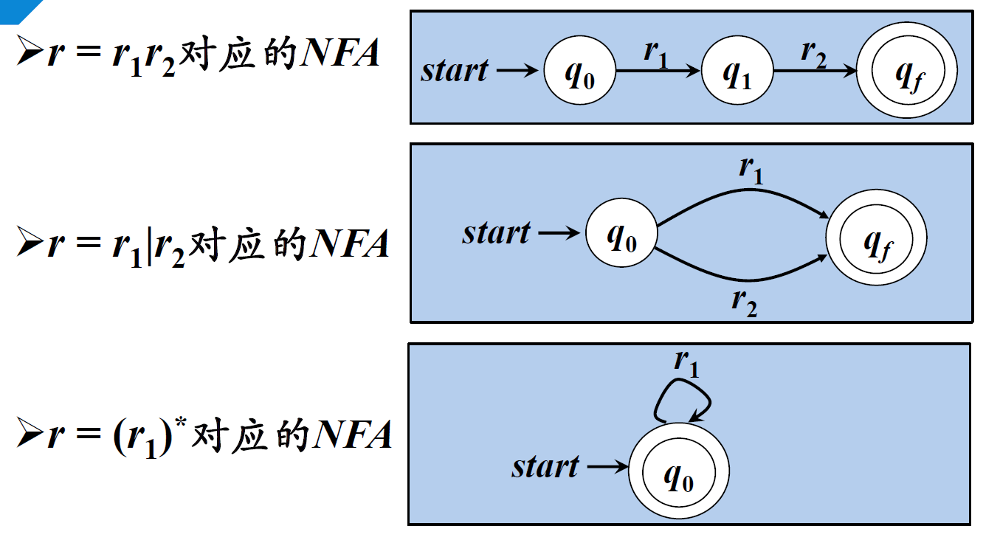

## 编译原理

### 绪论
编译：将高级语言翻译成汇编语言或机器语言的过程  
高级语言   -编译->    汇编语言   -汇编->   机器语言  

可重定位：在内存中存放的起始位置不是固定的  
加载器：膝盖可重定位地址；将修改后的指令和数据放到内存中的适当位置
起始位置 + 相对地址 = 绝对地址  
链接器：将多个可重定位的机器代码文件连接到一起  

#### 编译器的结构  
词法分析  
语法分析(词法单元流)  
语义分析(语法树)  
中间代码生成  
机器无关代码优化  
目标代码生成  
机器相关代码优化  

#### 词法分析
扫描源程序的字符，识别出各个单词，确定**单词的类型**，转换成统一的词法单元(token<种别码，属性值>)  

|  | 单词类型 | 种别 | 种别码 |
| --- | --- | --- | --- |
| 1 | 关键字 | if else... | 一词一码 |
| 2 | 标识符 | 变量名，数组名... | 多词一码 |
|3|常量|整形、浮点型、字符型、布尔型|一型一码|
|4|运算符|算术 逻辑 关系| 一词一码|
|5|界限符|{}();|一词一码|

#### 语法分析
从词法分析器输出的token序列中识别出各类短语，构造语法分析树

```
变量声明语句
int a = 10;
<D> = <T><IDS>;
<T> -> int | real | char | bool
<IDS> -> id | <IDS>,ID
```

#### 语义分析
声明语句 可执行语句  
* 识别标识符的属性信息  
  * 种属kind(简单变量 符合变量(数组))
  * 类型type(整形、字符型、布尔型)
  * 存储位置长度addr
  * 作用域
  * 参数和返回值
* 语义检查
  * 变量未声明就使用
  * 重复声明
  * 运算类型不匹配
  * 数组下标不是整数
  * 函数调用参数类型个数不匹配
  * 函数返回类型有误
生成符号表(用来存放标识符的属性信息的数据结构)  
每一个标识符对应符号表一条记录  
(存放标识符起始位置 + 长度)

#### 中间代码生成
* 三地址码
  每个指令最多三个操作数
  * 四元式
* 语法树

#### 目标代码生成
为程序中使用的变量合理分配寄存器

#### 代码优化
等价程序变换
* 机器无关优化(中间代码)
* 机器相关优化(目标代码)

### 语言及其文法
字母表：又穷符号集合  
字母表运算：
* 乘积 {0, 1}{a, b} -> {0a, 0b, 1a, 1b}
* 0次幂 空串{ε}表示
* n次幂(长度为n的符号串构成的集合) {0, 1}^3 -> {0, 1}{0, 1}{0, 1} = {111, 001...} 8个
* 正闭包(长度整数的符号串构成的集合) {a, b, c, d}+ -> {a, b, c, d, aa, ab... aaa, aab... aaaa, aaab}
* 克林闭包(正闭包 + 空串ε) 任意符号串构成的集合 长度可以为0
串：  
克林闭包中的每一项都是串  
串的长度 = 串中符号的个数  
空串 = 长度为0的串ε(连接运算的单位元)  
串上的运算：  
* 连接 z = xy 将y附加到x后面  εx = xε = x x是z的前缀 y是z的后缀 
* 幂 
  * 0次幂 x^0 = ε 
  * n次幂 x^n s=ab s^2=abab s^3=ababab s^n将n个s连接起来
  
### 文法
<名词> -> apple
句子的构成规则： 语言的基本符号(apple) + 语法成分(名词)  
G = (Vt, Vn, P, S)
* Vt 终结符集合 基本符号 token
* Vn 非终结符集合 语法成分
* P 产生式集合 将终结符和非终结符组合成串的形式
  * α -> β  <句子> -> <名词短语><动词短语>
* S 开始符号 <句子>

一些约定：
* α -> β1 | β2 (多个候选式)
* 终结符 (小写字母 运算符 标点符号 数字 粗体字符串)
* 非终结符 (大写字母 S 斜体 代表程序构造的大写字母ETF)

### 语言的定义
* 推导 
* 规约
---
* 句型(既可以包含终结符也可以包含非终结符)
* 句子(不包含非终结符的句型)

### 文法分类
* 0型文法 无限制文法 左侧至少包含一个非终结符
* 1型文法 上下文有关文法 左侧非总结发个数少于右侧
* **2型文法** 上下文无关文法 左侧必须为非终结符
* 3型文法 正则文法 (左线性A->wB或A->w 右线性A->Bw)


CFG(2型文法)分析树  
对推导过程得到的每一个句型，都可以构造出一个分析树
* 短语 分析树中的子树的边缘称为该句型的短语
* 直接短语 高度为2的子树的边缘 一定是某个产生式的右部

二义性文法  
如果一个文法可以为某个句子生成多个分析树  


### 词法分析
#### 正则表达式
正则文法 == 正则表达式  
有穷自动机Finite Automata  
系统只需要根据当前所处的状态和当前面临的输入信息就可以决定系统的后继行为。
每当系统处理了当前的输入后，系统的内部状态也将发生改变  
转换图  
* 初始状态
* 终止状态
给定输入串x，如果存在一个对应于串x的从初始状态到某个终止状态的转换序列，则称串x被该FA接收  
最长字串匹配原则  
在到达某个终态之后，只要输入带上还有符号，DFA就继续前进，以便寻找尽可能长的匹配  

又穷自动机的分类  
* 确定的有穷自动机 DFA -> 转换图 | 转换表 容易实现
* 非确定的又穷自动机 NFA(带空边) 直观
正则文法 == 正则表达式 == 有穷自动机  

正则表达式 -> NFA -> DFA  
* 正则表达式 -> NFA 
  
* NFA -> DFA
DFA的每个状态是一个由NFA中的状态构成的集合，是NFA状态集合的子集

P18


