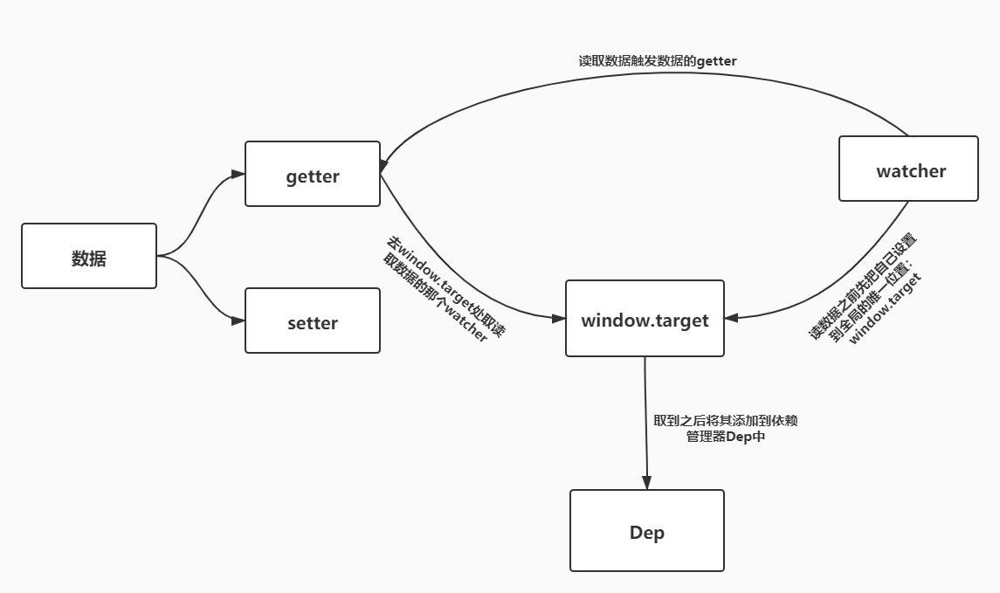
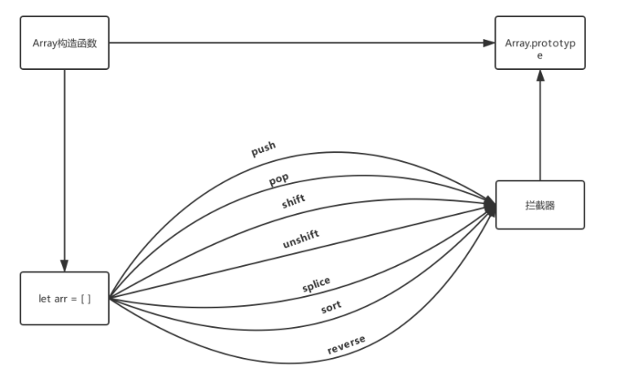
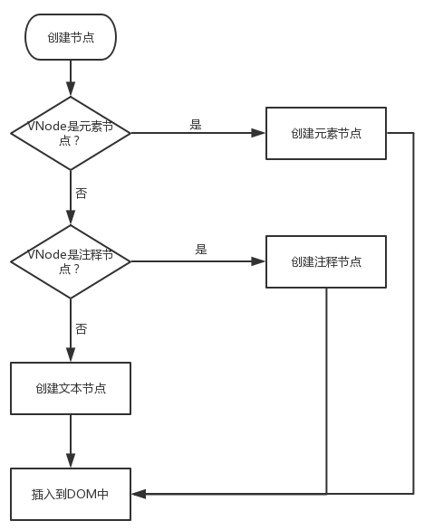
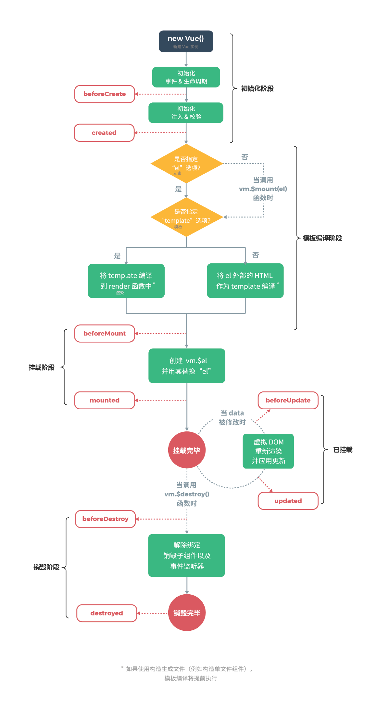

参考: <https://vue-js.com/learn-vue/start/>  
#### 变化侦测  
数据驱动视图(数据变化引起视图变化)  
`UI = render(state)`  
上述公式中 状态state是输入，页面UI输出，状态输入一旦变化了，页面输出也随之而变化。我们把这种特性称之为数据驱动视图。
我们知道`state`和`UI`都是用户定的，而不变的是这个`render()`。所以Vue就扮演了`render()`这个角色，当Vue发现`state`变化之后，
经过一系列加工，最终将变化反应在`UI`上。

##### Object的变化侦测  
`Object.defineProperty`使数据变得可观测
```js
let car = {}
let val = 3000
Object.defineProperty(car, 'price', {
  enumerable: true,
  configurable: true,
  get(){
    console.log('price属性被读取了')
    return val
  },
  set(newVal){
    console.log('price属性被修改了')
    val = newVal
  }
})
```
通过`Object.defineProperty()`方法给`car`定义了一个`price`属性，并把这个属性的读和写分别使用`get()`和`set()`进行拦截，
每当该属性进行读或写操作的时候就会触发`get()`和`set()`  
定义一个`observer`类，通过递归的方式，将一个正常的`object`转换成可观测的`object`  
value新增一个`__ob__`属性，值为该`value`的`Observer`实例。这个操作相当于为`value`打上标记，表示它已经被转化成响应式了，避免重复操作

##### 依赖收集
为每一个数据都建立一个依赖管理器(`Dep`)，把这个数据所有的依赖都管理起来  

在getter中收集依赖，在setter中通知依赖更新。  
在`getter`中调用了`dep.depend()`方法收集依赖，在`setter`中调用`dep.notify()`方法通知所有依赖更新  

谁用到了数据，谁就是依赖，我们就为谁创建一个`Watcher`实例  
数据变化时，我们不直接去通知依赖更新，而是通知依赖对应的`Watch`实例，由`Watcher`实例去通知真正的视图  

`Watcher`先把自己设置到全局唯一的指定位置`（window.target）`，然后读取数据。因为读取了数据，所以会触发这个数据的`getter`。
接着，在`getter`中就会从全局唯一的那个位置读取当前正在读取数据的`Watcher`，并把这个`watcher`收集到`Dep`中去。
收集好之后，当数据发生变化时，会向`Dep`中的每个`Watcher`发送通知。通过这样的方式，`Watcher`可以主动去订阅任意一个数据的变化。  
  

1. `Data`通过`observer`转换成了`getter/setter`的形式来追踪变化。
2. 当外界通过`Watcher`读取数据时，会触发`getter`从而将`Watcher`添加到依赖中。
3. 当数据发生了变化时，会触发`setter`，从而向`Dep`中的依赖（即`Watcher`）发送通知。
4. `Watcher`接收到通知后，会向外界发送通知，变化通知到外界后可能会触发视图更新，也有可能触发用户的某个回调函数等。


#### Array的变化侦测

在`Vue`中创建了一个数组方法拦截器，它拦截在数组实例与`Array.prototype`之间，
在拦截器内重写了操作数组的一些方法，当数组实例使用操作数组方法时，其实使用的是拦截器中重写的方法，
而不再使用`Array.prototype`上的原生方法

把它挂载到数组实例与`Array.prototype`之间  
把数据的`__proto__`属性设置为拦截器`arrayMethods`


### 虚拟DOM
把组成一个`DOM`节点的必要东西通过一个`JS`对象表示出来，那么这个`JS`对象就可以用来描述这个`DOM`节点，
我们把这个`JS`对象就称为是这个真实`DOM`节点的虚拟`DOM`节点  
用`JS`模拟出一个`DOM`节点，称之为虚拟`DOM`节点。当数据发生变化时，我们对比变化前后的虚拟`DOM`节点，
通过`DOM-Diff`算法计算出需要更新的地方，然后去更新需要更新的视图。  
#### VNode类
`VNode`类中包含了描述一个真实`DOM`节点所需要的一系列属性，
如`tag`表示节点的标签名，`text`表示节点中包含的文本，`children`表示该节点包含的子节点等。  
通过属性之间不同的搭配，就可以描述出各种类型的真实`DOM`节点  
节点类型
```
注释节点 text isComment
文本节点 text
元素节点 tag class attributes children
组件节点 
函数式组件节点
克隆节点 将已存在的节点复制一份，模板编译优化时使用
```
视图渲染之前，将`template`模板编译成`vnode`并缓存，数据变化需要重新渲染时，
将数据变化后生成的`vnode`与缓存下来的`vnode`进行对比，有差异的`VNode`对应的真实`DOM`节点就是需要重新渲染的节点
根据有差异的`vnode`创建出真实的`dom`节点插入到视图中，完成视图更新

#### dom-diff过程
patch: 对比两份vnode,以新的VNode为基准，改造旧的oldVNode使之成为跟新的VNode一样  
三种节点能够被创建并插入到dom中`createElm 元素节点(有没有tag)，文本节点，注释节点(isComment)`  
1. 创建节点

2. 删除节点 `removeNode 移除父节点的children`  
3. 更新节点  
```
静态节点: 只有纯文字，没有变量(数据的变化与其无关)  
1. vnode oldVnode 均为静态节点 (无需处理)
2. vnode为文本节点 (比较文本)
3. vnode为元素节点
    3.1 包含子节点 (递归更新)
    3.2 不包含子节点 (该节点为空节点，直接清空)
```


### 更新子节点
四种情况
```
遍历vnode 和 oldNode
for (let i = 0; i < newChildren.length; i++) {
  const newChild = newChildren[i];
  for (let j = 0; j < oldChildren.length; j++) {
    const oldChild = oldChildren[j];
    if (newChild === oldChild) {
      // ...
    }
  }
}
1.创建子节点
    创建节点 插入的合适位置是所有未处理节点之前，而并非所有已处理节点之后
2.删除子节点
3.移动子节点
    移动到所有未处理节点之前
4.更新节点
```

### 优化更新节点


为了避免双重循环数据量大时间复杂度升高带来的性能问题，而选择了从子节点数组中的4个特殊位置互相比对  
新前 旧后  
新后 旧后  
新后 旧前 (将old节点移动到所有未处理节点之后)  
新前 旧后 (将old节点移动到所有未处理节点之前)  

更新节点要以新VNode为基准，然后操作旧的oldVNode，使之最后旧的oldVNode与新的VNode相同  
从两边向中间循环  

### 模板编译
把用户在`<template></template>`标签中写的类似于原生HTML的内容进行编译，
把原生HTML的内容找出来，再把非原生HTML找出来，经过一系列的逻辑处理生成渲染函数，
也就是render函数的这一段过程称之为模板编译过程。   

```
用户写的模板 -> 模板编译 -> render函数 -> VNode -> patch -> 视图  
                            模板编译  |   虚拟dom
```
模板解析：生成抽象语法树(abstract syntax tree) parse  
优化阶段：遍历ast，找出静态节点，打上标记 optimizer  
代码生成：将ast转换成渲染函数 codegen  


#### 模板解析
模板解析其实就是根据被解析内容的特点使用正则等方式将有效信息解析提取出来，
根据解析内容的不同分为HTML解析器，文本解析器和过滤器解析器。
而文本信息与过滤器信息又存在于HTML标签中，所以在解析器主线函数parse中先调用HTML解析器
parseHTML 函数对模板字符串进行解析，如果在解析过程中遇到文本或过滤器信息则再调用相应
的解析器进行解析，最终完成对整个模板字符串的解析。  


### 生命周期 


1. 初始化
2. 模板编译
3. 挂载
4. 销毁

`new Vue()`执行vue的构造函数
```js
function vue(options) {
    this._init(options)
}
function _init(options) {
  const vm = this
  // 合并(mergeOptions)并挂载options
  // 初始化一些属性，事件，响应式数据...
  // callHook(vm, 'beforeCreate')
  // callHook(vm, 'created')
  // 判断是否传入el选项 
    // 传入：调用$mount函数进入模板编译挂载阶段
    // 没有：不进入下一个生命周期阶段，需要用户手动执行vm.$mount
}
```


